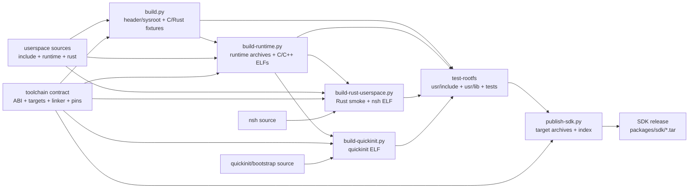

# Userspace package graph and SDK release hand-off

Status: Roadmap 5.1.8. This document is the release-order contract for the
repositories that assemble the first Norx userspace. It describes the current
staging pipeline; it does not turn generated files in `toolchain/build/` or
`test-rootfs/` into source artifacts.

## Ownership

| Repository or path | Owns | Must not own |
| --- | --- | --- |
| `userspace/include/` | Public C ABI headers and syscall numbers | Target JSON, linker scripts, generated sysroot |
| `userspace/runtime/` | C/C++ startup objects, freestanding runtime, headers, and runtime fixtures | Host CRT/libc or SDK archives |
| `userspace/rust/` | `no_std` Rust userspace API, allocator/startup boundary, and Rust fixture source | Rust compiler pin or generated target artifacts |
| `toolchain/` | Target specs, linker scripts, host-tool pins, build scripts, SDK manifest, and release assembly | A second copy of userspace headers or runtime sources |
| `quickinit/` | Init policy and freestanding bootstrap source | Toolchain or runtime implementation |
| `nsh/` | Shell source and host/target shell tests | A private copy of `userspace/rust` |
| `test-rootfs/` | Disposable target-aware staging, test evidence, and release staging directories | Canonical source or hand-edited SDK contents |

The source-of-truth rule is strict: a public header or runtime source is edited
in `userspace`, then staged into `toolchain/build/sysroot` and
`test-rootfs/usr/include` by the build scripts. A staged copy is never edited
back into `userspace`.

## Dependency graph

The arrows below are build-time inputs. Hash manifests and target checks are
release evidence, not additional source dependencies.



The minimal release order is therefore:

1. freeze compatible commits of `userspace`, `toolchain`, `quickinit`, `nsh`,
   and `test-rootfs`;
2. build and validate the toolchain/sysroot;
3. build the C/C++ runtime and stage its target archives and ELF fixtures;
4. build the Rust userspace fixture and the integrated `nsh` ELF;
5. build the quickinit bootstrap after the runtime archive exists;
6. publish one SDK archive per target and its hash index;
7. run the source-boundary guard and the target/QEMU smoke gates before
   promoting the release staging directory.

No later step may regenerate or edit an earlier source tree. If a source
changes, restart at the first affected step and regenerate all downstream
artifacts.

## Handoff details

### 1. Toolchain and public headers

`toolchain/scripts/build.py` consumes:

- `userspace/include/` and `userspace/runtime/include/`;
- `toolchain/abi.toml`, `targets/`, `linker/`, `versions.toml`, and the C/Rust
  smoke fixtures;
- pinned host LLVM tools and Rust nightly.

It produces the ignored `toolchain/build/sysroot/`, copies the public headers
to `test-rootfs/usr/include/`, builds C/Rust target fixtures, and writes the
toolchain hash manifest under `test-rootfs/var/lib/toolchain/`. This stage is
the only place where the generated sysroot is assembled.

Release acceptance:

- the native ARM64 target builds;
- ELF headers and `_start` are validated;
- no host header or CRT is used;
- `check_boundaries.py` reports no tracked `build/` or `sysroot/` path and the
  generated sysroot exactly matches the canonical userspace headers.

### 2. C/C++ runtime package

`userspace/runtime/gamma.toml` describes the `runtime` package. Its build
command is `toolchain/scripts/build-runtime.py`, which requires the generated
sysroot and consumes the runtime source tree plus C/C++ examples. It stages,
per target, `libnorxrt.a`, `libnorxcxx.a`, C/C++ ELF fixtures, and the runtime
hash manifest into `test-rootfs/usr/lib`, `test-rootfs/tests/runtime`, and
`test-rootfs/var/lib/runtime`.

The runtime archive is a prerequisite for both the Rust userspace build and
the quickinit bootstrap. A missing archive is a hard failure; neither consumer
has a fallback to a host library or a different target's archive.

### 3. Rust userspace and shell integration

`userspace/rust/gamma.toml` describes the `rust-userspace` source package.
`toolchain/scripts/build-rust-userspace.py` requires the pinned Rust toolchain,
the generated target contract, lld, and each target's `libnorxrt.a`. It stages
the Rust userspace smoke ELF under `test-rootfs/tests/rust`.

The same integration command currently builds `nsh` from its separate
repository because the first shell ELF consumes the shared
`userspace/rust` crate and the runtime archive. The shell source is an input to
this integration gate, not a second SDK source tree. Its staged ELF and hash
live under `test-rootfs/tests/nsh`; it is not copied into the SDK archives.

### 4. quickinit bootstrap

`quickinit/gamma.toml` declares the service package and its target triples.
`toolchain/scripts/build-quickinit.py` consumes `quickinit/bootstrap`, the
generated target contract, and each target's runtime archive. It stages the
validated bootstrap ELF and hash under `test-rootfs/tests/quickinit` and
`test-rootfs/var/lib/quickinit`.

The host-testable quickinit policy library remains in the `quickinit` source
repository. The freestanding bootstrap is the only artifact handed to the
current kernel/QEMU smoke path; it is not an SDK library.

### 5. SDK publication

After the toolchain and runtime stages pass, `toolchain/scripts/publish-sdk.py`
reads `toolchain/sdk.toml` and creates one deterministic archive per target in
`test-rootfs/packages/sdk/`. Each archive contains:

- the generated public headers under `sysroot/include/`;
- the target runtime archives and runtime ELF fixtures;
- the target JSON, linker script, `abi.toml`, and `versions.toml`;
- an embedded `manifest.toml` with file sizes and SHA-256 hashes.

The sibling `index.toml` records archive names, target triples, sizes, and
archive hashes. Rust userspace, `nsh`, and quickinit ELFs remain test-rootfs
artifacts and are intentionally not part of this SDK release format.

`test-rootfs/packages/sdk/` is release staging, not an installed package
database. The future Gamma `.gpk` package format owns signatures, ownership,
installation, profiles, and rollback.

## Declared versus enforced dependencies

The current Gamma recipes describe package identity, target triples, build
commands, and output paths. The scripts enforce the stronger artifact order
shown above:

| Consumer | Direct enforced inputs | Output |
| --- | --- | --- |
| `runtime` | `toolchain/build/sysroot`, `userspace/runtime`, pinned LLVM | runtime archives and C/C++ fixtures |
| `rust-userspace` + `nsh` integration | toolchain contract, `userspace/rust`, `nsh`, `build/runtime/*/libnorxrt.a`, pinned Rust/lld | Rust userspace and `nsh` ELFs |
| `quickinit` | `quickinit/bootstrap`, toolchain contract, `build/runtime/*/libnorxrt.a`, pinned Rust/lld | quickinit ELFs |
| SDK publisher | generated sysroot, runtime outputs, toolchain metadata | target SDK archives and index |

When Gamma grows a full dependency resolver, these enforced script inputs
must become explicit package edges. Until then, a recipe that omits a script
prerequisite must not be interpreted as evidence that the stage is independent
or safe to run out of order.

## Release checklist

Run from the workspace containing the sibling repositories:

```text
python toolchain/scripts/build.py
python toolchain/scripts/build-runtime.py
python toolchain/scripts/build-rust-userspace.py
python toolchain/scripts/build-quickinit.py
python toolchain/scripts/publish-sdk.py
python -m unittest discover -s toolchain/tests -p 'test_*.py'
python toolchain/scripts/check_boundaries.py --require-sdk
```

Then verify the target/QEMU smoke gates and archive hashes. A release hand-off
is complete only when all commands succeed for the native `aarch64-unknown-norx` target, the SDK `abi_version` matches the consumer contract,
and the generated artifacts are retained as evidence rather than committed
into a source repository.
